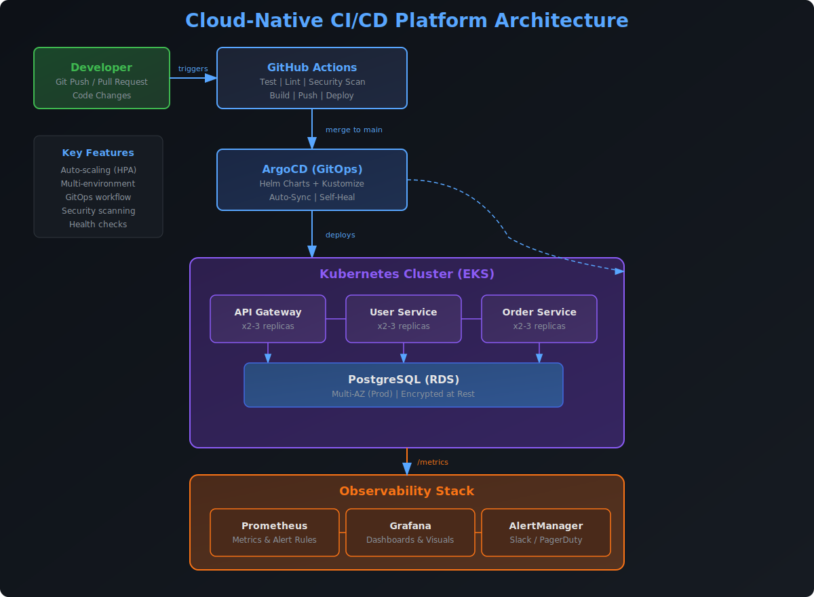
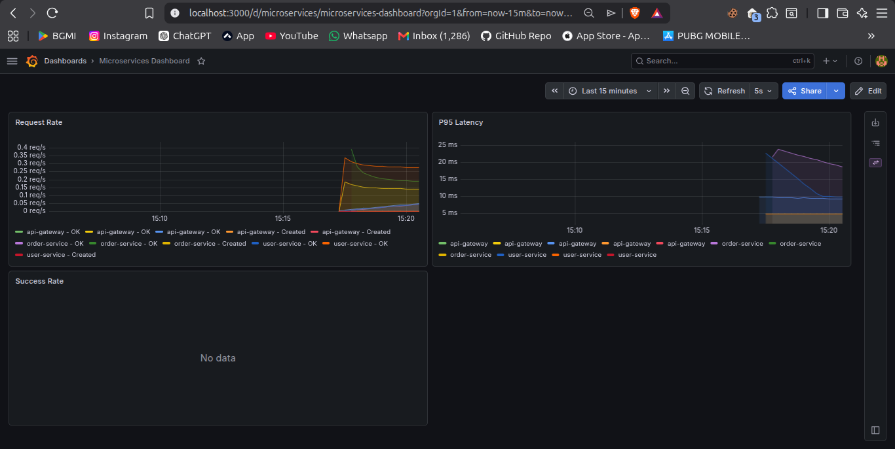
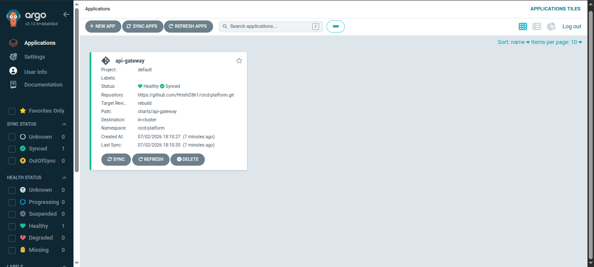
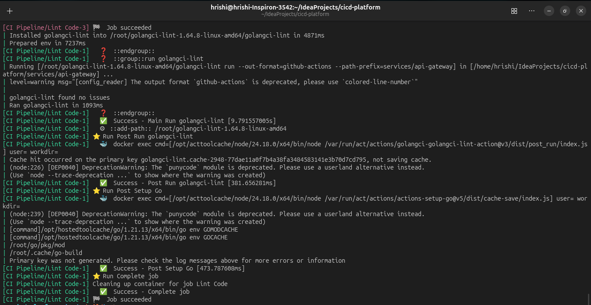

<p align="center">
  <h1 align="center">Cloud-Native CI/CD Platform</h1>
  <p align="center">Production-ready microservices platform with full CI/CD, GitOps & Observability</p>
</p>

<p align="center">
  <a href="https://golang.org/">
    
  </a>
  <a href="https://www.docker.com/">
    
  </a>
  <a href="https://kubernetes.io/">
    
  </a>
  <a href="https://www.terraform.io/">
    
  </a>
  <a href="https://aws.amazon.com/">
    
  </a>
</p>

<p align="center">
  <a href="https://github.com/features/actions">
    
  </a>
  <a href="https://argoproj.github.io/cd/">
    
  </a>
  <a href="https://helm.sh/">
    
  </a>
  <a href="https://kustomize.io/">
    
  </a>
  <a href="https://www.postgresql.org/">
    
  </a>
</p>

<p align="center">
  <a href="https://prometheus.io/">
    
  </a>
  <a href="https://grafana.com/">
    
  </a>
  <a href="https://aquasecurity.github.io/trivy/">
    
  </a>
  <a href="https://github.com/aquasecurity/trivy">
    
  </a>
  <a href="https://opensource.org/licenses/MIT">
    
  </a>
</p>

---

## Overview

A complete **DevOps & Cloud Engineering** platform demonstrating enterprise-grade practices for building, deploying, and operating cloud-native applications. From code commit to production deployment — fully automated.

### Key Features

- **Microservices Architecture** — API Gateway pattern with 3 independently deployable services
- **End-to-End CI/CD** — Automated testing, security scanning, and container builds
- **GitOps** — Declarative, self-healing deployments with ArgoCD
- **Infrastructure as Code** — Complete AWS provisioning with Terraform modules
- **Observability** — Real-time metrics, dashboards, and intelligent alerting
- **Multi-Environment** — Dev / Staging / Prod with Kustomize overlays

---

## Architecture



---

## Demo

<!-- Drop the recording in once captured. -->
<!--  -->

> A short end-to-end demo — `argocd app sync` promoting a change, followed by a
> walkthrough of the live Grafana dashboard — is the best way to show this
> platform in motion.

**How to record one:**

```bash
# Option A — asciinema (terminal only, lightweight)
asciinema rec docs/screenshots/demo.cast
#  ... run:  kubectl apply -f infra/argocd/applications.yaml
#            argocd app sync api-gateway user-service order-service
#            argocd app wait api-gateway --health
#  Ctrl-D to stop, then convert to a GIF:
agg docs/screenshots/demo.cast docs/screenshots/demo.gif

# Option B — full-screen capture (to include the Grafana + ArgoCD UIs)
#  Use a screen recorder, walk through:
#    1. argocd app sync in the terminal
#    2. the ArgoCD UI showing Synced / Healthy
#    3. the Grafana Microservices dashboard with live traffic
#  Export to docs/screenshots/demo.gif and uncomment the image tag above.
```

## Screenshots

Proof artifacts live in [`docs/screenshots/`](docs/screenshots/) — see that
folder's README for exactly what to capture. Once added they render here:

### Grafana Dashboard



### ArgoCD Sync



### GitHub Actions



---

## Tech Stack

### Core

| Badge | Technology | Purpose |
|-------|------------|---------|
|  | **Go 1.21** | Microservices runtime |
|  | **Docker** | Containerization with multi-stage builds |
|  | **Kubernetes** | Container orchestration |

### Infrastructure

| Badge | Technology | Purpose |
|-------|------------|---------|
|  | **Terraform** | Infrastructure as Code |
|  | **AWS** | VPC, EKS, RDS, ECR |
|  | **Helm** | Kubernetes package manager |
|  | **Kustomize** | Environment-specific configs |

### CI/CD & GitOps

| Badge | Technology | Purpose |
|-------|------------|---------|
|  | **GitHub Actions** | CI/CD pipeline |
|  | **ArgoCD** | GitOps continuous delivery |
|  | **GitHub CR** | Container registry |

### Observability & Security

| Badge | Technology | Purpose |
|-------|------------|---------|
|  | **Prometheus** | Metrics collection |
|  | **Grafana** | Visualization & dashboards |
|  | **Trivy** | Vulnerability scanning |
|  | **PostgreSQL** | Relational database |

---

## Project Structure

```
.
├── services/                       # Microservices
│   ├── api-gateway/                # API Gateway (routing, metrics)
│   ├── user-service/               # User management CRUD
│   └── order-service/              # Order management CRUD
├── charts/                         # Helm Charts
│   ├── api-gateway/
│   ├── user-service/
│   └── order-service/
├── infra/                          # Infrastructure
│   ├── terraform/                  # AWS (VPC, EKS, RDS, ECR)
│   │   ├── modules/
│   │   │   ├── vpc/
│   │   │   ├── eks/
│   │   │   ├── ecr/
│   │   │   └── rds/
│   │   ├── main.tf
│   │   ├── variables.tf
│   │   └── outputs.tf
│   └── argocd/                     # GitOps App Definitions
│       └── applications/
├── overlays/                       # Kustomize Environments
│   ├── dev/
│   ├── staging/
│   └── prod/
├── monitoring/                     # Observability
│   ├── prometheus/
│   │   ├── prometheus.yml
│   │   └── rules/
│   └── grafana/
│       └── dashboards/
├── scripts/                        # Utilities
├── .github/workflows/              # CI/CD Pipelines
├── docker-compose.yml              # Local Development
└── Makefile                        # Common Commands
```

---

## Quick Start

### Prerequisites

- [Docker](https://docs.docker.com/get-docker/)
- [Make](https://www.gnu.org/software/make/)
- [Go](https://go.dev/doc/install) (for local development)

### Run Locally

```bash
# Clone the repository
git clone https://github.com/Hrishi2861/cicd-platform.git
cd cicd-platform

# Start all services (API, DB, Prometheus, Grafana)
make dev-up

# View logs
docker compose logs -f

# Stop services
make dev-down
```

### API Endpoints

<p align="center">
  
  
  
</p>

| Method | Endpoint | Description |
|--------|----------|-------------|
| `GET` | `/health` | Health check |
| `GET` | `/metrics` | Prometheus metrics |
| `GET` | `/api/v1/users` | List all users |
| `POST` | `/api/v1/users` | Create a user |
| `GET` | `/api/v1/users/{id}` | Get user by ID |
| `GET` | `/api/v1/orders` | List all orders |
| `POST` | `/api/v1/orders` | Create an order |
| `GET` | `/api/v1/orders/{id}` | Get order by ID |

### Try It Out

```bash
# Create a user
curl -X POST http://localhost:8080/api/v1/users \
  -H "Content-Type: application/json" \
  -d '{"email": "john@example.com", "name": "John Doe"}'

# Create an order
curl -X POST http://localhost:8080/api/v1/orders \
  -H "Content-Type: application/json" \
  -d '{"user_id": "<user-id>", "product_name": "Laptop", "quantity": 1, "total_price": 999.99}'

# List users
curl http://localhost:8080/api/v1/users

# List orders
curl http://localhost:8080/api/v1/orders
```

---

## Monitoring Dashboards

<p align="center">
  
  
</p>

| Service | URL | Credentials |
|---------|-----|-------------|
| **Prometheus** | http://localhost:9090 | — |
| **Grafana** | http://localhost:3000 | `admin` / `admin` |

### Alerting Rules

- **High Error Rate** — 5xx responses exceed 5%
- **High Latency** — P95 response time > 1s
- **Pod Restarts** — Container restart detected
- **High CPU** — CPU usage > 80% for 10+ minutes
- **High Memory** — Memory usage > 90% for 10+ minutes

---

## CI/CD Pipeline

### Workflow

```
Pull Request → Test → Lint → Security Scan → Merge
                                           ↓
                                    Build & Push
                                           ↓
                                    Update Manifests
                                           ↓
                                    ArgoCD Auto-Sync
```

### Pipeline Stages

| Stage | Tool | Description |
|-------|------|-------------|
| **Test** | `go test` | Unit tests with coverage reports |
| **Lint** | `golangci-lint` | Static code analysis |
| **Security** | **Trivy** | Container & dependency vulnerability scan |
| **Build** | **Docker Buildx** | Multi-stage builds with caching |
| **Push** | **GHCR** | Push to GitHub Container Registry |
| **Deploy** | **ArgoCD** | GitOps auto-sync to Kubernetes |

### Triggers

| Event | Actions |
|-------|---------|
| **Pull Request** | Test + Lint |
| **Merge to main** | Full pipeline (test → lint → scan → build → push → deploy) |

---

## Infrastructure Deployment

### Prerequisites

```bash
# Required tools
brew install terraform kubectl helm awscli   # macOS
# or use your package manager
```

### Deploy AWS Infrastructure

```bash
cd infra/terraform
terraform init
terraform plan -var="db_username=admin" -var="db_password=securepassword"
terraform apply -var="db_username=admin" -var="db_password=securepassword"
```

### Deploy ArgoCD

```bash
kubectl create namespace argocd
kubectl apply -n argocd -f https://raw.githubusercontent.com/argoproj/argo-cd/stable/manifests/install.yaml
kubectl apply -f infra/argocd/applications.yaml
```

### Access ArgoCD UI

```bash
kubectl port-forward svc/argocd-server -n argocd 8080:443
# Username: admin
# Password: kubectl -n argocd get secret argocd-initial-admin-secret -o jsonpath="{.data.password}" | base64 -d
```

---

## Environment Configuration

<p align="center">
  
  
  
</p>

| Environment | Replicas | Resources | Multi-AZ | Deploy Command |
|-------------|----------|-----------|----------|----------------|
| **Dev** | 1 | Minimal | No | `kubectl apply -k overlays/dev/` |
| **Staging** | 2 | Standard | No | `kubectl apply -k overlays/staging/` |
| **Production** | 3 | High | Yes | `kubectl apply -k overlays/prod/` |

---

## Security Features

<p align="center">
  
  
  
  
</p>

- **Image Scanning** — Trivy vulnerability scanning in CI pipeline
- **ECR Lifecycle** — Automatic cleanup of old images (keep last 10)
- **IAM Roles** — Least-privilege roles for EKS cluster and nodes
- **Secrets Management** — Kubernetes secrets for database credentials
- **Network Isolation** — VPC security groups restricting RDS access
- **Encryption at Rest** — RDS storage encryption, ECR image encryption

---

## Portfolio Highlights

<p align="center">
  
  
  
</p>
<p align="center">
  
  
  
</p>
<p align="center">
  
  
  
</p>
<p align="center">
  
  
</p>

---

<p align="center">
  <sub>Built with ❤️ using Go, Docker, Kubernetes, and Terraform By Hrishikesh</sub>
</p>
